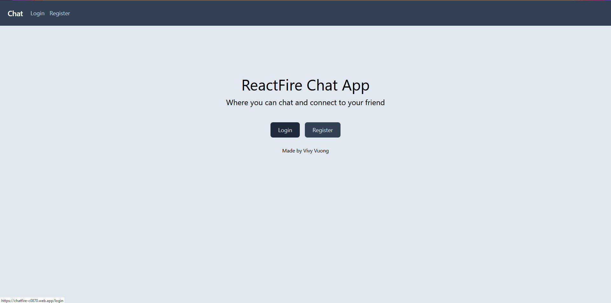
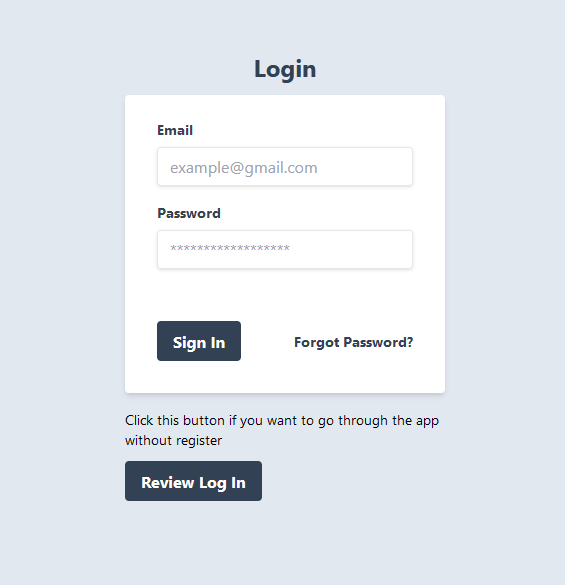
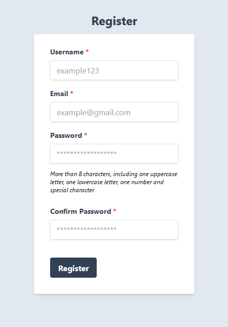
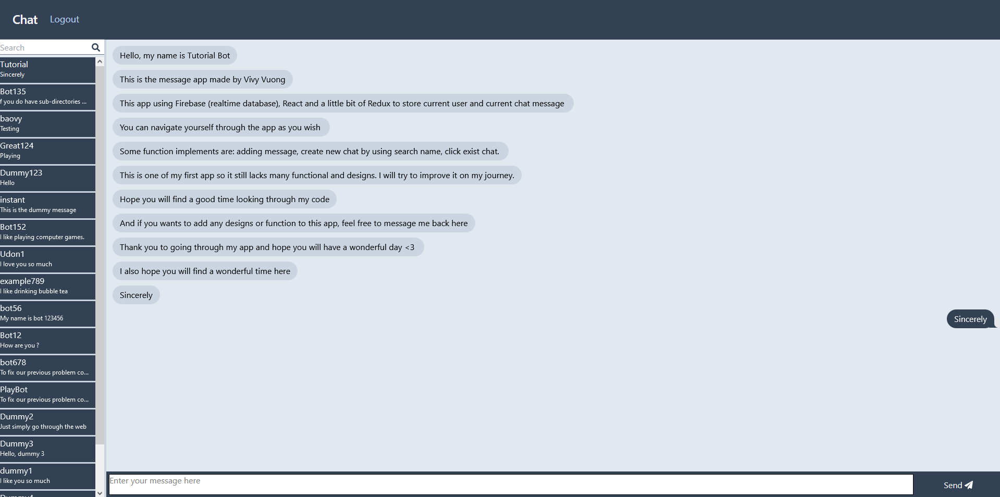

# Message App - Sending Messages To Other People

# Website Address (Hosted By Firebase)
https://chatfire-c0870.web.app/

# Languages: 
    1. Front-End: Javascript, HTML, CSS, ReactJS
    2. Application State: Redux
    3. Backend: Firebase
    
# Usage:
    1. Sending and receiving message from people
    2. Find people based on their display name
    3. Review old messages or old chats
    
     
# Showcase:

## Landing Page

## Login && Register

## Homepage(Signed In)

